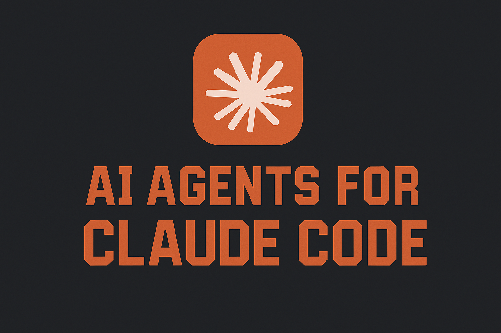

# Claude Code Agents

  

A collection of useful AI Agents for use with **Claude Code** (or any other **SWE** agent)
The main goal of this repository is to collect and index useful "AI Agents" for use with Claude Code for efficient and fast software development.
Currently it contains a single agent that I wrote and use, but I will add more as I write and use them or find any other ones.
Contributions are more than welcomed, cheers!

*PS: I am fully aware that these prompt are not really full blown AI agents, but I call them like that because it's convenient and it also serves an SEO purpose.*

## Agents

## Project Analyzer

The purpose of this agent is to analyze a code base and then create a detailed documentation for it in the `.aidocs` folder, so people can be onboarded on to a project fast, as well as to use it as a context for any other agents or feature implementations, bug fixes and similar.
This is the first version I wrote and have tested on a couple of personal projects that are decently sized, however I haven't tested it yet on a big code base, that I plan to do soon and fix any issues I encounter with the prompt.
Suggestion and improvements based on your usage are welcomed.

The prompt is located in the [Project_Analyzer_v1.md](Project_Analyzer_v1.md) file.
