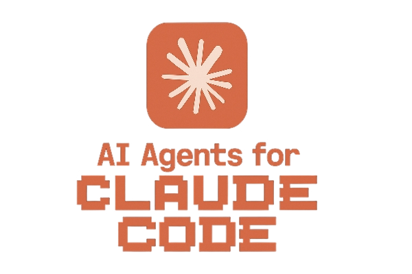

# Claude Code Agents

  

A collection of useful AI agents for use with **Claude Code** (or any other **SWE** agent).

The main goal of this repository is to collect and index useful "AI agents" for fast and efficient software development.  
Currently, it contains a single agent that I wrote and use, but I will add more as I write and use them or find other ones.  
Contributions are more than welcome, cheers!

*PS: I am fully aware that these prompts are not really full-blown AI agents, but I call them that because it's convenient and also serves an SEO purpose.*

## Agents

### Project Analyzer

The purpose of this agent is to analyze a codebase and then create detailed documentation for it in the `.aidocs` folder, so people can be onboarded onto a project quickly. It can also be used as context for other agents, feature implementations, bug fixes, and similar tasks.  
This is the first version I wrote and have tested on a couple of decently sized personal projects. However, I haven't tested it yet on a large codebase, something I plan to do soon and will fix any issues I encounter with it.
Suggestions and improvements based on your usage are welcome.

The prompt is located in the [Project_Analyzer_v1.md](Project_Analyzer_v1.md) file.
